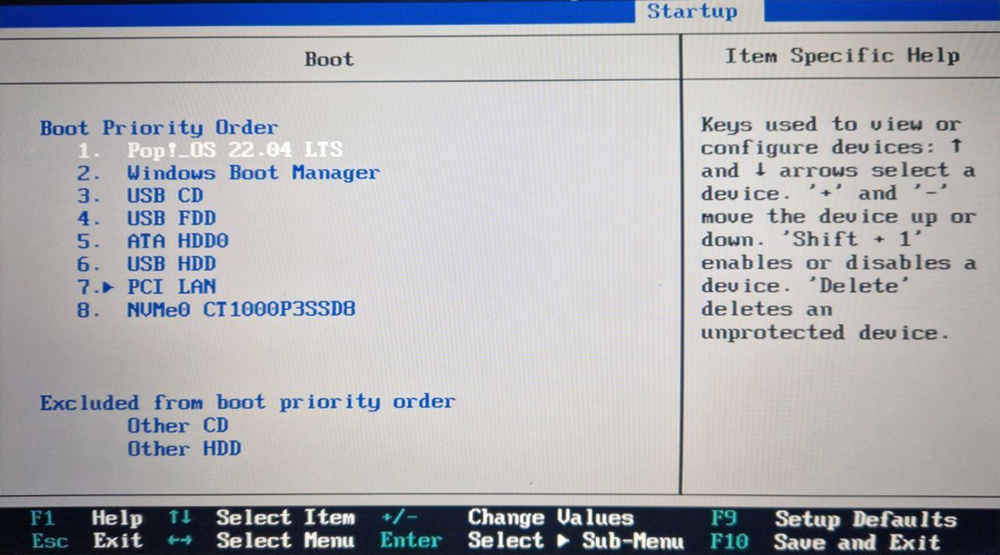

# Simepel to reboot Linux/Pop_os! to Windows and back

 to 

### This is a how to step-by-step guide on how to boot from one operating system to a different one using UEFI without relying on GRUB. Here's a basic outline of the process:
## Requirements
A Pc/Laptop with 2 hdd/ssd.
* Main hdd/ssd with Pop_os! installed.
* Second hdd/ssd Windows installed.

## Step .1
## Boot config
* Go to boot config in your Bios/UFEI 
* set priorty boot 1. Pop_os! LTS 
* And 2. Windows Boot Manager 

### Exempel image

## Step .2 
* Boot in to Pop_os 
* install for Linux skrip 

        cd Downloads/
        git clone https://github.com/Stradios/L-W-os-boot.git
        cd L-W-os-boot/for_linux-pop_os_swap/
        chmod +x boot-window.sh
        ./boot-window.sh
* After install you need to reload the Gui do [ Alt+F2 ] [ r ] and [ Enter
]
* the icon will be in you app drawer

* you can use it to boot in Windows to continue to Step .3 

## step .3 
* boot in Windows 
 dowlod the Git file unzip it go to folder /L-W-os-boot/for Windows os swap/Pop_os! Boot
 * run the Pop_os!_boot.bat file to istall the sript 
 * the icon will apear in the start menu 
 

 ### Now you can you it to simles boot between os 